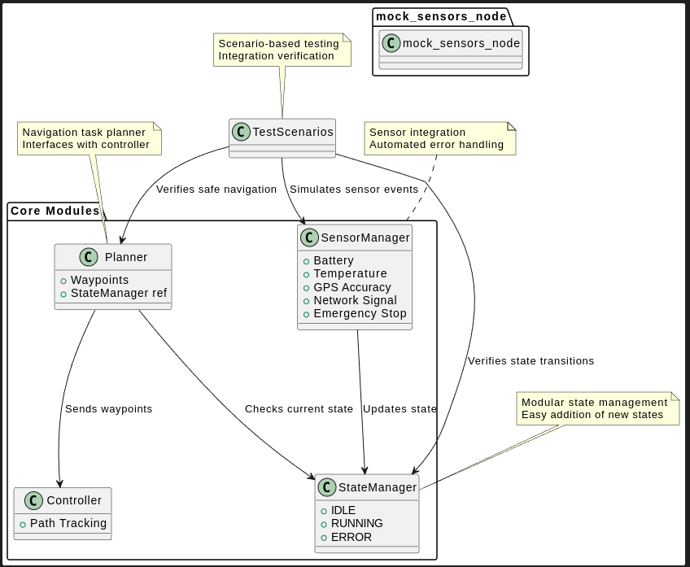
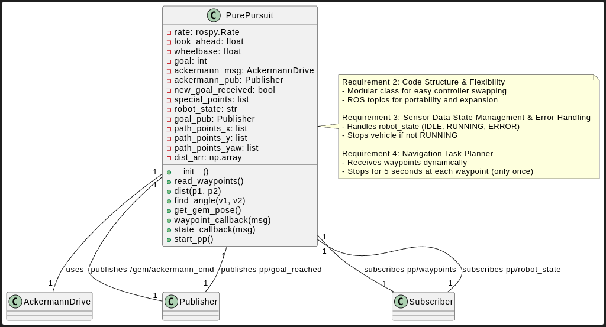
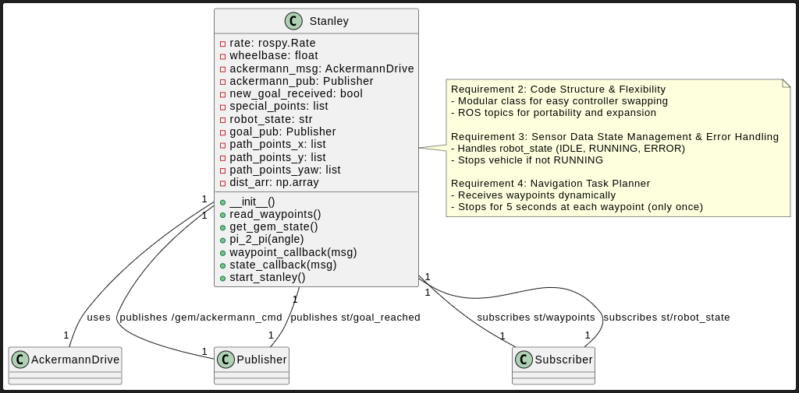

# Polaris GEM e2 Decision-Making System

## Docker Setup & Quickstart
A Docker environment is provided for easy setup and reproducibility.

### 1. Build the Docker Image
```bash
docker build -t assignment:latest .
```

### 2. Verify the Docker Image
```bash
docker image ls
```

### 3. Launch the Container with Docker Compose
```bash
docker compose up -d
```

### 4. Enter the Running Container
```bash
docker exec -it assignment-assignment-1 bash
```

### 5. Initialize the ROS Workspace
```bash
cd catkin_ws
source devel/setup.bash
```

---

## Overview
This repository implements a modular, scalable decision-making and planning system for the Polaris GEM e2 autonomous vehicle simulator. It manages operational states (IDLE, RUNNING, ERROR), integrates sensor data, and interfaces with path-tracking controllers (Stanley or Pure Pursuit).

---

### Codebase Architecture

[View PlantUML Source](docs/uml/code_structure.puml)

---

### Pure Pursuit Controller Interface

[View UML Source](docs/uml/pure_pursuit_intyerface.uml)

---

### Stanley Controller Interface

[View UML Source](docs/uml/stanley_interface.uml)

---

## Installation & Simulation Environment
1. **Install the POLARIS_GEM_e2 simulator**  
   Follow instructions at [GEMillins / POLARIS_GEM_e2 · GitLab](https://gitlab.com/GEMillins/POLARIS_GEM_e2).

2. **Build the workspace**  
   ```
   cd ~/catkin_ws
   catkin_make
   source devel/setup.bash
   ```

3. **Launch the simulator**  
   ```
   roslaunch gem_gazebo gem_gazebo_rviz.launch velodyne_points:="true"
   ```

## Launching the Decision-Making System

### 1. Choose and launch the controller
You can select either Stanley or Pure Pursuit controller using the `controller_type` argument.

**Stanley Controller:**
```
roslaunch polaris_decision_maker state_manager.launch controller_type:=stanley
roslaunch polaris_decision_maker controller.launch controller_type:=stanley
```

**Pure Pursuit Controller:**
```
roslaunch polaris_decision_maker state_manager.launch controller_type:=pure_pursuit
roslaunch polaris_decision_maker controller.launch controller_type:=pure_pursuit
```

### 2. Launch the mock sensor simulation
This node simulates sensor failures for scenario testing:
```
roslaunch polaris_decision_maker mock_sensor_sim.launch
```

## Monitoring Topics
- **Goal Reached:**
  ```
  rostopic echo /st/goal_reached
  rostopic echo /pp/goal_reached
  ```
- **Waypoints Sent:**
  ```
  rostopic echo /st/waypoints
  rostopic echo /pp/waypoints
  ```

## Assignment Features
- Modular state management (IDLE, RUNNING, ERROR)
- Sensor integration and automated error handling
- High-level planner sends waypoints only under safe conditions
- Flexible controller selection (Stanley or Pure Pursuit)
- Scenario-based testing with mock sensors

## Scenario Testing
The system supports the following scenarios via mock_sensors_node:
- Battery Failure
- Temperature Spike
- GPS Fluctuation
- Network Signal Fluctuation
- Emergency Stop

Integration tests verify that navigation tasks are sent only under safe conditions.

## Deliverables
- **Repository:** Modular, well-documented code
- **README:** This file
- **Dockerfile:** All dependencies for simulation and system
- **Demonstration Video:** Shows launch, navigation, and scenario testing
- **Performance Report:** Analysis of response times, robustness, and recovery

---

## Codebase Structure
The codebase is organized into modular components for clarity and scalability:

- **StateManager**: Handles operational states (IDLE, RUNNING, ERROR). Manages transitions based on sensor data and supports easy extension for new states or porting to ROS2.
- **SensorManager**: Monitors battery, temperature, GPS accuracy, network signal, and emergency stop. Triggers ERROR state and recovery based on sensor thresholds.
- **Planner**: High-level navigation planner. Interfaces with StateManager to send waypoints to the controller only when the robot is in a safe state.
- **Controller**: Path-tracking controller (Stanley or Pure Pursuit). Receives waypoints from Planner and executes navigation.
- **mock_sensors_node**: Simulates sensor failures and scenario events for testing. Used to verify system robustness and error handling.
- **TestScenarios**: Integration and scenario tests to ensure navigation tasks are sent only under safe conditions.

### Component Interactions
- SensorManager updates StateManager with sensor status.
- Planner queries StateManager before sending waypoints to Controller.
- mock_sensors_node simulates sensor events for scenario testing.
- TestScenarios verify correct system behavior and safe navigation.

Refer to the PlantUML diagram (`codebase_architecture.puml`) for a visual overview of these relationships.

---


**Key Features:**
- Flexible selection of path-tracking controllers via launch file argument (`controller_type`).
- Simple addition and expansion of robot states.
- Modular architecture for easy maintenance and future upgrades.

---

## Sensor Data State Management & Error Handling

The system manages robot states using the following sensor thresholds:
- **Battery level**: ERROR if ≤ 50%
- **Temperature**: ERROR if ≥ 55°C
- **GPS accuracy**: ERROR if < 200mm for ≥ 15s
- **Network signal**: ERROR if unconnected for ≥ 10s, or low signal for ≥ 20s
- **Emergency stop**: Immediate ERROR on activation

Errors are cleared automatically when sensors return to safe operating thresholds.

---

## Navigation Task Planner
- The Planner determines when the robot should navigate, based on current state.
- Waypoints are sent to the controller only when the robot is in RUNNING state.
- The controller (Stanley or Pure Pursuit) is selected dynamically via launch file argument.
- Waypoints can be added statically or dynamically via ROS topic (`/add_waypoint`).

---

## Scenario Development & Testing

The system supports the following test scenarios using `mock_sensors_node`:
- **Battery Failure**: Drops from 100% to 51% over 30s, then to 49%. ERROR at 50%.
- **Temperature Spike**: Rises from 30°C to 55°C over 30s, then 60°C. ERROR at 55°C.
- **GPS Fluctuation**: High accuracy initially, goes < 200mm for 20s. ERROR if <200mm for ≥ 15s.
- **Network Signal Fluctuation**: Connected, then low for 10s, then connected, then not connected for 20s.
- **Emergency Stop**: Immediate ERROR on activation.

Integration tests verify that navigation tasks are sent only under safe conditions.

---

## Video Demonstration

### 1. Navigation Task Planner (`demo_pure_pursuit.mkv`, `demo_stanley.mkv`)

These videos demonstrate the navigation workflow and planner-controller interaction:

- **Waypoint Management:**  
  - The controller receives waypoints from the static `wps.csv` file (no dynamic global planner yet).
  - In `sensor_monitor.cpp`, four demonstration waypoints are added to the planner:
    - `{150.0, 100.0, 0.0}`
    - `{0.0, 197.0, 0.0}`
    - `{-130.0, 157.0, 0.0}`
    - `{-100.0, 11.0, 0.0}`
  - Waypoints are sent sequentially; `state_manager.cpp` dispatches the next waypoint once the previous goal is reached.
  - The mission starts only when manually triggered via the `/start_mission` topic.
  - The controller pauses for 5 seconds at each waypoint before proceeding.
  - The system can be extended to accept interactive waypoint input from the user.

### 2. Sensor State Transitions (`mock_state_transitions.mkv`)

This video highlights sensor-driven state management and error handling:

- **Battery Level:**  
  - ERROR state if battery ≤ 50%.
- **Temperature:**  
  - ERROR state if temperature ≥ 55°C.
- **GPS Accuracy:**  
  - ERROR state if accuracy < 200 mm for ≥ 15 seconds.
- **Internet Signal Strength:**  
  - ERROR state if disconnected for ≥ 10 seconds.
  - ERROR state if low signal for ≥ 20 seconds.
- **Emergency Stop:**  
  - Immediate ERROR state on activation.

Errors are cleared automatically when sensor readings return to safe thresholds.

---

These demonstrations verify that navigation tasks are dispatched only under safe conditions, and that the system robustly manages operational states in response to sensor events.

### Improvements / Future Work
- Implement a dynamic global planner to generate waypoints instead of relying on static files.
- Extend the architecture to include a global planner, local planner, and controller for full autonomy.
- Performance Analysis : Response times: Fast reaction to sensor-triggered state changes.

